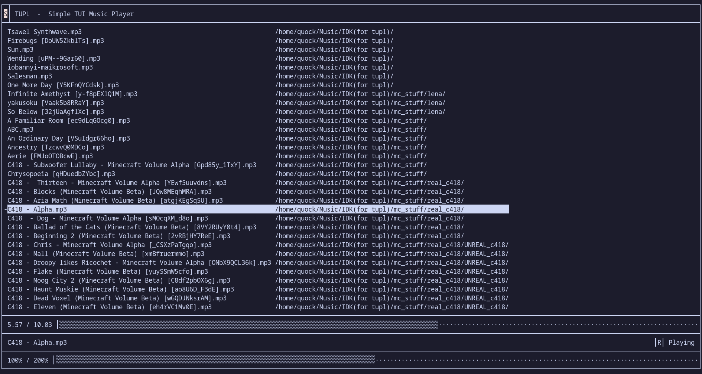

# Tupl
This is a simple TUI music player written in C


## Compiling
Just build nob:
```sh
cc -o nob nob.c
```
And run it:
```sh
./nob
```
The executable will be located in `build/tupl`

## Usage
Tupl looks for supported audio files in `~/Music`
Supported formats are:
- WAV
- QOA
- OGG
- MP3
- FLAC
- XM
- MOD

Controls:
- Normal mode (N)

    | Key   | Action                    |
    |:-----:|:--------------------------|
    | q     | Quit                      |
    | Esc   | Clear search              |
    | h     | Goto previous match       |
    | j     | Move down list            |
    | k     | Move up list              |
    | l     | Goto next match           |
    | Enter | Play selected file        |
    | s     | Enter seek mode           |
    | f     | Enter find mode           |
    | m     | Cycle through queue modes |
    | r     | Redraw UI                 |

- Seek mode (S)

    | Key   | Action                   |
    |:-----:|:-------------------------|
    | Esc   | Enter normal mode        |
    | h     | Seek backward 10 seconds |
    | j     | Decrease volume by 5%    |
    | k     | Increase volume by 5%    |
    | l     | Seek forward 10 seconds  |
    | Space | Pause / Unpause          |

- Find mode (F)

    | Key   | Action                            |
    |:-----:|:----------------------------------|
    | Esc   | Clear pattern & Enter normal mode |
    | Enter | Enter normal mode                 |

Queue modes:

| Char  | Meaning             |
|:-----:|:--------------------|
| S     | Stop                |
| L     | Loop                |
| N     | Play next in list   |
| R     | Play random in list |


## Credits
- https://github.com/tsoding/nob.h
- https://github.com/raysan5/raudio

